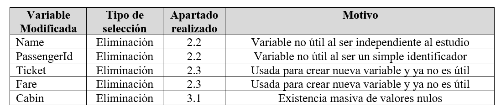

<style>
body {
text-align: justify}
</style>


```{r setup, include=FALSE}
knitr::opts_chunk$set(echo = TRUE, fig.align="center")
options(width = 500)

```

<br><br><br>


```{r load_libraries, message=FALSE, warning=FALSE, include=FALSE}
# Cargamos las librerias de  R que vamos a usar
library("ISLR")
library("SmartEDA")
library("tidyverse")
library(DT) # Para visualizar tablas
library(VIM)
library(readr)
library(plyr)
library (MASS)
library(grid)
library(ggpubr) # Para QQ plot
library(ggplot2) # Para graficos
# library(stringr) #Para str_to_title()
# library(reshape) #Para Pivot Tables
# library(VIM) # Para kNN
library(psych) # Para Grafico Correlaciones
library(pastecs) #Para tabla resumen cuantitativa
library(gmodels) #Para tabla resumen cualiativa
library(knitr) #Para Kable
library(kableExtra) #Para Kable
library(hrbrthemes) #Para gráficos densidades
library(dplyr) #Para gráficos densidades
library(vioplot) #Para gráficos violin
library(PASWR) #Estadístico z
library(BSDA) #Estadístico z.test
library(lsr) #Eta2
library(faraway) #Multicolinealidad
library(gridExtra) #Grid graficas
library(corrplot) #Plot para correlaciones
library(ResourceSelection) #Hosmer Lemeshowi
library(InformationValue) #ROC
library(plotROC)#ROC
library(DescTools) #Scheffe test
```

<br><br><br>


Introducción


El presente informe forma parte de la segunda práctica de la asignatura M2.851 - Tipología y ciclo de vida de los datos del Máster Universitario en Ciencia de Datos impartido por la Universitat Oberta de Catalunya.

En esta práctica se realizarán técnicas de limpieza de datos aplicadas a un juego de datos determinado y también se analizarán dichos datos para extraer información relevante y útil.

A su vez, se entregará, junto con la presente memoria, una serie de archivos con el código necesario para la realización de la limpieza y análisis con el que el usuario podrá realizar diferentes estudios analíticos a posteriori si lo desease.


******
# **Descripción del dataset. ¿Por qué es importante y qué pregunta/problema pretende responder?**
******

## **Descripción del dataset**


El dataset Titanic reune los datos sobre los pasajeros que viajaban a bordo del Titanic y registra para cada persona su supervivencia o no en el accidente. El Titanic transportaba a pasajeros con gran diversidad en sus niveles de renta y edad y a bordo se encontraban familias enteras.


La etiqueta (variable a predecir) es la variable dicotómica que indica si el viajero ha sobrevivido o no.


La ubicación en kaggle del dataset utilizado se muestra en el siguiente link:

https://www.kaggle.com/c/titanic/data

Los archivos disponibles son 3 y están en formato csv. Sus nombres son:

•	train.csv  
•	test.csv  
•	gender_submission.csv: Ejemplo a seguir en la entrega de la competición Kaggle (no útil).  


Según los registros, en el Titanic viajaban 2229 personas, de las cuales 913 formaban parte de la tripulación del barco. El dataset que obtenemos de Kaggle tiene un total de 1309 registros, por lo tanto, no todos los pasajeros que viajaban a bordo están incluidos en el dataset y podemos asumir que el juego de datos es una muestra de toda la población a analizar.

El dataset original está compuesto por dos ficheros: el fichero pensado para realizar el entrenamiento de un modelo (train.csv) y el fichero con los datos destinados a testear la calidad del modelo (test.csv). El fichero de entrenamiento contiene una columna más que el fichero de prueba. Esta columna corresponde a la columna de la clase "Survived".   

El fichero de entrenamiento tiene 891 registros mientras que el fichero de test contiene 418 instancias.  


Las variables de las que se compone el dataset son y sus unidades o magnitudes de las características son: 

**PassengerId**:  
Identificador del pasajero  
Tipo: Entero indicando un identificador único de casa instancia.  

<p>

**Survived**:  
Indica si el pasajero ha sobrevivido la catástrofe  
Tipo: Entero (categórica) 0 = No ha sobrevivido; 1 = Ha sobrevivido  

<p>

**Pclass**:  
Clase en la que viajaba el pasajero  
Tipo: String (categórica) 1 = 1 a clase; 2 = 2 a clase; 3 = 3a clase  

<p>

**Name**:  
Nombre del pasajero  
Tipo: String  

<p>

**Sex**:  
Sexo del pasajero  
Tipo: String (categórica) female = Mujer; male = hombre  

<p>

**Age**:  
Edad del pasajero  
Tipo: Entero  

<p>

**SibSp**:  
Indica si el pasajero tenía hermanos o pareja a bordo  
Tipo: Entero  

<p>

**Parch**:  
Indica si el pasajero tenía padres o hijos a bordo  
Tipo: Entero  

<p>
        
**Ticket**:  
Número del billete  
Tipo: String alfanumérico  

<p>
 
**Fare**:  
Precio del billete sin especificar si es un billete individual o grupal  
Tipo: Número Real  


**Cabin**:  
Número de camarote  
Tipo: String  

<p>
        
**Embarked**:  
Indica si el pasajero ha embarcado o no y donde  
Tipo: String (categórica) C = Cherbourg, Q = Queenstown, S = Southampton  

       
Los datos no han pasado por un proceso de preprocesado o limpieza, por lo que aún pueden existir inconsistencias y el formato no es necesariamente el más adecuado para un análisis directo.

**Carga del dataset**:

Cargamos el dataset y mostramos sus dimensiones, estructura y tipo de datos:


```{r echo=TRUE, message=FALSE, warning=FALSE}
# Carga de los archivos que contienen los datos del train y test
test <- read.csv("titanic/test.csv")
train <- read.csv("titanic/train.csv")

train_rows <- dim(train)
test_rows <- dim(test)

train_rows
test_rows
```

```{r echo=TRUE, message=FALSE, warning=FALSE}
# Estructura de los archivos train.csv y test.csv
str(train)
str(test)
```


Visualizamos las primeras líneas del conjunto de entrenamiento y de test.  
```{r echo=TRUE, message=FALSE, warning=FALSE}
# Primeras líneas del conjunto de entrenamiento y de test.
head(train)
head(test)
```

## **¿Por qué es importante el dataset?**


Este dataset es importante porque nos permite esclarecer qué factores pudieron influir en la supervivencia de viajeros del Titanic y obtener el conocimiento necesario para poder hacer predicciones con nuevas instancias.  

Estos factores intuimos que pueden ser el estatus social, el sexo, la edad y también tener familiares cerca. 

Asimismo, podemos ver si las pautas marcadas por la sociedad de "mujeres y niños primero" se cumplen cuando las personas se encuentran en situaciones de estres extremo.

De igual forma, y en el ámbito de la ciencia de datos, este dataset es importante porque es considerado un clásico y ha ayudado a muchos estudiantes a enfrentarse por primera vez a un problema de limpieza de datos, análisis estadísticos e incluso a técnicas de machine learning.


## **¿Qué problema pretende responder el dataset?**


Este dataset pretende responder a cuáles son los diferentes factores que afectaron a la posibilidad de supervivencia de personas en el accidente del Titanic.


******
# **Integración y selección de los datos**
******


## **Integración de los Datos**


La integración es un proceso que forma parte de la fase de limpieza de datos y se entiende como la fusión de datos para crear una estructura única que tenga la información necesaria para el posterior análisis de datos.

Existe la integración horizontal, que básicamente se compone de la adición de nuevos atributos a partir de otras fuentes mediante sus relaciones usando claves primarias y la integración vertical, que se basaría en añadir más instancias al juego de datos (siempre manteniendo la integridad de los atributos).

En nuestro caso, tenemos dos archivos train.csv y test.csv, dónde la diferencia entre ambos es que el test no tiene las etiquetas de la variable “Survived”.

**Integración Vertical**:

Con la finalidad de observar las distribuciones de las variables que serán base del estudio en la predicción de “Survived” integraremos verticalmente los dos archivos y así obtendremos un mayor número de datos para ver sus medidas de tendencia central y dispersión.

Para que la integración vertical sea satisfactoria, las variables y estructura de ambos archivos debe coincidir, por tanto, crearemos un dataframe train_sin_etiqueta que se integrará con las instancias de test.csv al cual llamaremos df_total_sin_etiqueta.

Observamos que la integración es satisfactoria puesto que las instancias ahora son 1309 (891 + 418).


```{r echo=TRUE, message=FALSE, warning=FALSE}
# Creación archivo train_sin_etiqueta.csv

etiquetas <- subset(train, select = Survived)
train_sin_etiqueta <- subset(train, select = -Survived)

# Integración archivos train.csv y test.csv
df_total_sin_etiqueta = rbind(train_sin_etiqueta, test)
dim(df_total_sin_etiqueta)

# Guardamos el archivo con el nombre Titanic_global_sin_etiqueta.csv
write.csv(df_total_sin_etiqueta, "Titanic_global_sin_etiqueta.csv", row.names = FALSE)
```

**Integración Horizontal**:

Los archivos en la plataforma Kaggle no exponen ni fuentes externas ni csv adicionales que definan nuevas variables que se puedan integrar horizontalmente a nuestro juego de datos.


**Comprobación de líneas duplicadas**:


Comprobamos si hay líneas duplicadas en el dataframe usando `duplicated`. No existen registros duplicados, pero sí detectamos dos pares de personas con el mismo nombre. Para asegurarnos que se trata de personas diferentes, buscamos los registros que tengan los nombres Connolly, Miss. Kate o Kelly, Mr. James.   

Podría tratarse de la misma persona que ha comprado dos billetes, pero en estos registros vemos que las personas tienen edades diferentes y no hay motivo para pensar que se trata de duplicados.  


```{r echo=TRUE, message=FALSE, warning=FALSE}
# Chequeo de líneas duplicadas
df_total_sin_etiqueta[duplicated(df_total_sin_etiqueta),]

df_total_sin_etiqueta[duplicated(df_total_sin_etiqueta[c("Name","Sex")]),]
df_total_sin_etiqueta[df_total_sin_etiqueta$Name=="Kelly, Mr. James" | df_total_sin_etiqueta$Name == "Connolly, Miss. Kate",]

```


## **Selección de los Datos**


La selección se puede entender como un primer filtro de los datos, no solamente a través de poner límites a los valores de algunas instancias o elegir algún valor cualitativo específico, sino también a través de la inspección de las correlaciones entre los atributos y la posterior eliminación del dataset de aquellos que sean redundantes.

Debido a que el problema planteado es interpretar qué factores influyen en la supervivencia, a priori, no sabríamos si debemos descartar alguna variable o no (eliminación de la variable del estudio) o si deberíamos filtrar los datos, ya sean numérica o categóricamente.

No obstante, en esta sección eliminaremos la variable “Name” porque no es de mucha utilidad para nuestros análisis ya que el nombre no debería influir a priori en la supervivencia de los viajeros y también la variable “PassengerId” puesto que simplemente es un identificador.


Por lo tanto, además de esta primera selección relizada, esta fase del proceso la dejaremos abierta en este punto y retomaremos una vez la exploración y análisis nos vaya indicando qué debemos seleccionar y/o filtrar. A continuación, se hace una lista de las selecciones realizadas en este apartado y a posteriori.


```{r echo=TRUE, message=FALSE, warning=FALSE}
# Eliminamos variables Name
keep.cols <- c("Pclass", "Sex", "Age", "SibSp", "Parch", "Ticket", "Fare", "Cabin", "Embarked")
df_total_sin_etiqueta <- df_total_sin_etiqueta[keep.cols]

```


<br>

<p align="center">
  
</p>


## **Creación de nuevas variables**

Se ha detectado que hay números de billetes duplicados. Esto indica que hay dos tipos de tickets:

•	Individuales  
•	Grupales

Se observa que la variable “Fare” muestra el mismo precio para los tickets grupales, por tanto, para saber realmente el precio del ticket por viajero y también para poder usar correctamente la variable “Fare”, deberíamos saber de cuántas personas es el ticket grupal y después dividir la variable “Fare” for dicha cantidad.

Crearemos una columna con el recuento de billetes con el mismo id para cada pasajero y otra con el precio unitario.


```{r echo=TRUE, message=FALSE, warning=FALSE}
# Creación variable con el contaje de los tickets con mismo nombre
df_total_sin_etiqueta$Count.ticket <- (df_total_sin_etiqueta%>%group_by(Ticket)%>%mutate(count=n()))$count
```

```{r echo=TRUE, message=FALSE, warning=FALSE}
# Creación variable con el precio unitariocontaje de los tickets con mismo nombre
df_total_sin_etiqueta$Unit.price <- df_total_sin_etiqueta$Fare / df_total_sin_etiqueta$Count.ticket
```


Selección de datos inicial a posteriori

```{r echo=TRUE, message=FALSE, warning=FALSE}
# Eliminamos variable Name
keep.cols <- c("Pclass", "Sex", "Age", "SibSp", "Parch", "Cabin", "Embarked", "Count.ticket", "Unit.price")
df_total_sin_etiqueta <- df_total_sin_etiqueta[keep.cols]

```


******
# **Limpieza de datos**
******

Hay que mencionar que se la limpieza de datos en este proyecto en particular debe afectar tanto al archivo train.csv como al test.csv, por tanto, limpiaremos los datos en base al dataframe global creado anteriormente (df_total_sin_etiqueta).


## **¿Los datos contienen ceros o elementos vacíos? ¿Cómo gestionarías cada uno de estos casos?**


### **Elementos vacíos en el dataset**

Comprobaremos si existen valores nulos o inexistentes en el juego de datos. 

```{r echo=TRUE, message=FALSE, warning=FALSE}
# Overview of the data - Type = 1
ExpData(data=df_total_sin_etiqueta,type=1)

# Structure of the data - Type = 2
ExpData(data=df_total_sin_etiqueta,type=2)

```

Una vez que sabemos que tenemos valores nulos, cuántos tenemos y sabemos las variables afectadas, se decide la estrategia para imputar dichos valores


**Variable Cabin**:

Observamos que la variable “Cabin” tiene 1014 valores nulos de 1309, por tanto, se decide eliminar dicha variable por la imposibilidad de realizar una imputación generalizada.


```{r echo=TRUE, message=FALSE, warning=FALSE}
# Eliminamos variable Cabin
keep.cols <- c("Pclass", "Sex", "Age", "SibSp", "Parch", "Embarked", "Count.ticket", "Unit.price")
df_total_sin_etiqueta <- df_total_sin_etiqueta[keep.cols]

```

**Variable Age**:

El número de registros de Age que son NA representan aproximadamente el 20% de los registros totales. 

Este dataset contiene variables categóricas y numéricas y para imputar los valores nulos de la variable Age podemos usar el método `kNN`. Aplicamos la función e imputamos los valores NA usando todos los demás campos del dataset y con un valor de k igual a 3. El algoritmo busca los registros de los 3 pasajeros más parecidos (cercanos según la distancia Gower) al que contiene un valor nulo y usa los datos de edades de estos pasajeros para imputar el valor faltante.

Una vez ejecutado el algoritmo para imputar los valores, volvemos a comprobar si existen valores NA y podemos confirmar que todos los NA para la variable edad han sido imputados.


```{r echo=TRUE, message=FALSE, warning=FALSE}

# Imputación de valores a los valores nulos de la variable age
df_total_sin_etiqueta <- kNN(df_total_sin_etiqueta, k=3)[1:10]
head(df_total_sin_etiqueta[is.na(df_total_sin_etiqueta$Age),])
df_total_sin_etiqueta <- df_total_sin_etiqueta[keep.cols]

```

```{r echo=TRUE, message=FALSE, warning=FALSE}
# Comprobacion de la no existencia de registros nulos para la variable age después de la imputación.
sum(is.na(df_total_sin_etiqueta$Age))
```


**Variable Embarked**:

Se observa que la mayoría de las instancias pertenecen a la categoría S, por tanto, las instancias con valores nulos en esta variable, las imputaremos a S.


```{r echo=TRUE, message=FALSE, warning=FALSE}
# Exploración del resumen de los datos de la varibale Embarked 
df_total_sin_etiqueta$Embarked <- as.factor(df_total_sin_etiqueta$Embarked)
summary(df_total_sin_etiqueta$Embarked)
```

```{r echo=TRUE, message=FALSE, warning=FALSE}
# Imputación clase mayoritaria a variable Embarked 
df_total_sin_etiqueta$Embarked[df_total_sin_etiqueta$Embarked == ""] <- "S"
summary(df_total_sin_etiqueta$Embarked)
```


**Variable Unit.price**:

Actuaremos de igual forma que con la variable Age e imputaremos a través del uso del kNN


```{r echo=TRUE, message=FALSE, warning=FALSE}

# Imputación de valores a los valores nulos de la variable age
df_total_sin_etiqueta <- kNN(df_total_sin_etiqueta, k=3)[1:10]
head(df_total_sin_etiqueta[is.na(df_total_sin_etiqueta$Unit.price),])
df_total_sin_etiqueta <- df_total_sin_etiqueta[keep.cols]

```


### **Gestión de los valores iguales a “cero” en el dataset**:


Ahora comprobamos las variables que toman valores igual a cero sin que tenga sentido que tomen este tipo de valor.   

La variable que representa la "clase" toma valores iguales a cero y consideramos que es correcto, lo mismo ocurre con las variables SibSp, Parch, donde consideramos normal que existan valores iguales a cero, significa que los pasajeros viajaban solos.  

En cambio, los valores iguales a cero para la variable Unit.price son algo más extraños. Entre los pasajeros que tienen un Unit.price igual a cero hay personas que viajaban en primera, segunda y tecera clase.  

La idea que un ticket sea gratuito no sería posible, por tanto, volveremos a aplicar el método kNN para imputar estos valores.  

Primero cambiaremos el valor de cero a NA y después actuaremos como en el apartado anterior.


```{r echo=TRUE, message=FALSE, warning=FALSE}

df_total_sin_etiqueta$Unit.price[df_total_sin_etiqueta$Unit.price == "0"] <- NA

# Imputación de valores a los valores ceros de la variable Unit.price
df_total_sin_etiqueta <- kNN(df_total_sin_etiqueta, k=3)[1:10]
head(df_total_sin_etiqueta[is.na(df_total_sin_etiqueta$Unit.price),])
df_total_sin_etiqueta <- df_total_sin_etiqueta[keep.cols]

# Comprobacion de la no existencia de registros ceros para la variable Unit.price después de la imputación.
sum(is.na(df_total_sin_etiqueta$Unit.price))
```


**Valores extremos** 

No hemos encontrado valores que estén fuera de un rango razonable. Las comprobaciones las hemos hecho anteriormente con `sapply(df, summary)`.  

Volvemos a visualizar boxplots para las variables numéricas que tenemos: Age y Fare.  


```{r echo=TRUE, message=FALSE, warning=FALSE}

oldpar = par(mfrow = c(2,2), mar=c(2,2,2,2))

# Boxplot variable Age
boxplot(df_total_sin_etiqueta$Age, main="Boxplot Variable Age",ylab="Edad (años)")
print("Boxplot Stats Variable Age\n")
boxplot.stats(df_total_sin_etiqueta$Age, coef = 1.5, do.conf = TRUE, do.out = TRUE)

# Boxplot variable Age
boxplot(df_total_sin_etiqueta$Unit.price, main="Boxplot Variable Unit.price",ylab="Precio billete unitario")
print("Boxplot Stats Variable Fare\n")
boxplot.stats(df_total_sin_etiqueta$Unit.price, coef = 1.5, do.conf = TRUE, do.out = TRUE)
```

El boxplot muestra que hay outliers en estas dos variables. La mayoría de los pasajeros eran jóvenes, aunque también encontramos pasajeros de más de 65 años. En cuanto a la variable Unit.price, se comprueba que a medida que el precio sube, la clase va bajando de 3 a 2 y de 2 a 1, con lo cual no hay razón porqué pensar que los precios no son reales. En la tabla siguiente podemos visualizar algunos de los pasajeros que pagaron un precio de billete alto. Notamos que todos son de primera clase.


```{r echo=TRUE, message=FALSE, warning=FALSE}
# Muestra de varios precios de billetes unitarios en el rango alto
tail(df_total_sin_etiqueta[df_total_sin_etiqueta$Unit.price>30,], 15)
```


Aunque se acepte que los precios son reales, es cierto que hay uno que es extremadamente alto y, aunque cierto, podría desvirtuar posibles futuras predicciones, por tanto se estima que se podría cambiar por la media de Unit.price agrupado por la primera clase, para tener un valor imputado más real.  


```{r echo=TRUE, message=FALSE, warning=FALSE}
# Imputación del valor máximo de Unit.price
df_price_Pclass <- aggregate( df_total_sin_etiqueta$Unit.price ~ df_total_sin_etiqueta$Pclass, df_total_sin_etiqueta, mean )
mean_Unit.price <- df_price_Pclass[2][[1]][1]

```

```{r echo=TRUE, message=FALSE, warning=FALSE}
# Muestra de varios precios de billetes unitarios en el rango alto
max_Unit.price <- max(df_total_sin_etiqueta$Unit.price)
max_Unit.price

df_total_sin_etiqueta$Unit.price[df_total_sin_etiqueta$Unit.price == max_Unit.price] <- mean_Unit.price
mean_Unit.price
```

```{r echo=TRUE, message=FALSE, warning=FALSE}

oldpar = par(mfrow = c(2,2), mar=c(2,2,2,2))

# Boxplot variable Age
boxplot(df_total_sin_etiqueta$Age, main="Boxplot Variable Age",ylab="Edad (años)")
print("Boxplot Stats Variable Age\n")
boxplot.stats(df_total_sin_etiqueta$Age, coef = 1.5, do.conf = TRUE, do.out = TRUE)

# Boxplot variable Age
boxplot(df_total_sin_etiqueta$Unit.price, main="Boxplot Variable Unit.price",ylab="Precio billete unitario")
print("Boxplot Stats Variable Fare\n")
boxplot.stats(df_total_sin_etiqueta$Unit.price, coef = 1.5, do.conf = TRUE, do.out = TRUE)
```


******
# **Análisis de datos**
******

Una vez limpiado el archivo que contenía las líneas de los conjuntos train y test, deberemos separar otra vez los conjuntos ya que únicamente tenemos datos de la etiqueta para el conjunto de entrenamiento.


```{r echo=TRUE, message=FALSE, warning=FALSE}
# Creación del conjunto de train y test después de la limpieza del dataset
train <- df_total_sin_etiqueta[1:train_rows, ]
test <- df_total_sin_etiqueta[(train_rows + 1):(train_rows+test_rows), ]

```


Y añadimos las etiquetas al conjunto de train:

```{r echo=TRUE, message=FALSE, warning=FALSE}
# Adición de las etiquetas al conjunto de entrenamiento
train <- cbind(train, etiquetas )
```

Guardamos en disco los archivos train y test procesados y "limpios" preparados para su posterior análisis.

```{r echo=TRUE, message=FALSE, warning=FALSE}
# Guardamos en disco los archivos procesados
write.csv(train, "train_processed.csv", row.names = FALSE)
write.csv(test, "test_processed.csv", row.names = FALSE)
```


**Screening**  

Antes de crear las visualizaciones determinamos que las variables numéricas son:  Age y Unit.price que corresponden a la edad de los pasajeros y el precio unitario del billete.  
Survived, Sex, Cabin, Embarked son variables categóricas y Pclass, SibSp, Parch son variables categóricas ordinales (existen rangos en los valores de las variables).  

Realizamos las transformaciones oportunas para guardar las variables con sus tipos correspondientes.  

```{r echo=TRUE, message=FALSE, warning=FALSE}
# Categóricas
train$Survived <- as.factor(train$Survived)
train$Sex <- as.factor(train$Sex)

# Categóricas ordinales
train$Pclass <- factor(train$Pclass, levels= c(1, 2, 3))
train$SibSp <- factor(train$SibSp, levels = c(0, 1, 2, 3, 4, 5, 8))
train$Parch <- factor(train$Parch, levels = c(0, 1, 2, 3, 4, 5, 6, 9))

```


Creamos una función que nos facilite visualizar las distribuciones de las variables, así como detectar posibles valores extremos.  

```{r echo=TRUE, message=FALSE, warning=FALSE}
#library(fitdistrplus)
visualiz <- function(data, colm, facet.colm, title, facetPlot=FALSE){
oldpar = par(mfrow = c(2,2), mar=c(2,2,2,2))
truehist(data[[colm]], main = title)
abline(v = mean(data[[colm]]), col="red", lwd=3, lty=2);
abline(v = median(data[[colm]]), lwd=3, lty=2, col="blue");
qqnorm(data[[colm]], main = title);qqline(data[[colm]], col = 2 )
if (facetPlot==TRUE) {
  boxplot(data[[colm]]~data[[facet.colm]], main = paste("Survived by", title))
}

boxplot(data[[colm]], main = title)
}
```


**Visualización de las variables numéricas**  

Los pasajeros que tienen edades entre los cuantiles 25 y 75 tienen entre 20 y 40 años. La edad mediana para los pasajeros que sobrevivieron y los que no es muy similar.  

```{r echo=TRUE, message=FALSE, warning=FALSE}
visualiz(train, "Age", "Survived", "Age", facetPlot=TRUE)
```


**CARLOS: HE QUITADO EL UNIT.PRICE MAX.. SE CONTRADICE CON EL SIGUIENTE PARRAFO, PUEDO DEJARLO O NO....**


Si vemos la variable Unit.price (precio unitario del billete), la mayoría de los pasajeros pagaron muy poco por el billete. Aquí en el boxplot encontramos outliers pero consideramos que no deberíamos descartar estas entradas ya que hay pocos pasajeros que pagaron un importe alto por el billete y esta información puede ser muy interesante para predecir la posibilidad de supervivencia: ¿Viajar en una clase privilegiada aumenta la posibilidad de sobrevivir?  

En el boxplot además podemos ver que las personas que sobreviven tienen una mediana más alta en el precio del billete. 

```{r echo=TRUE, message=FALSE, warning=FALSE}
visualiz(train, "Unit.price", "Survived", "Unit.price", facetPlot=TRUE)
```


A continuación visualizamos los datos para las variables Class, Sex, Siblings/Spouse, Parents/Children  


```{r echo=TRUE, message=FALSE, warning=FALSE}
oldpar = par(mfrow = c(2,3), mar=c(2,2,2,2))

plot(table(train$Pclass, train$Survived), col = c("black", "orange"), main="Class")

plot(table(train$Sex, train$Survived), col = c("black", "orange"), main="Sex")

plot(table(train$SibSp, train$Survived), col = c("black", "orange"), main="Siblings/Spouse")

plot(table(train$Parch, train$Survived), col = c("black", "orange"), main="Parents/Children")

plot(table(train$Embarked, train$Survived), col = c("black", "orange"), main="Embarked")

plot(table(train$Count.ticket, train$Survived), col = c("black", "orange"), main="Embarked")

```


Las personas que viajaban en tercera clase tienen la menor proporción de supervivencia comparando con las personas que viajaban en primera clase. Las mujeres que viajaban en el titanic sobrevivieron en su mayoría. Los hombres sobrevivieron en mucho menor proporción.   

La mayoría de personas viajaba sin familiares (hermanos, pareja, padres o hijos) y parece ser que el porcentaje de supervivencia es algo más alto en personas que tenían familiares a bordo.   

La mayoría de personas embarcaron en el punto S, pero el mayor porcentaje de supervivencia lo tienen las personas que embarcaron en C.  

Los pasajeros que viajaban varias personas con el mismo billete también tienen una mayor supervivencia ( hasta 4 pasajeros ). 1 o más de 4 pasajeros con el mismo billete tienen la misma proporción de supervivencia.  

**Análisis bivariable**  

Vamos a visualizar algunos plots que nos permiten ver la supervivencia de pasajeros combinando dos variables.  

```{r echo=TRUE, message=FALSE, warning=FALSE}

grid.newpage()

sex.class <- ggplot(data=train, aes(x=Sex, fill=Survived))+geom_bar(position = 'fill')+facet_wrap(~Pclass)+ scale_fill_manual(values=c("black", "orange"))
sibs.class <- ggplot(data=train, aes(x=SibSp, fill=Survived))+geom_bar(position = 'fill')+facet_wrap(~Pclass)+ scale_fill_manual(values=c("black", "orange"))
parch.class <- ggplot(data=train, aes(x=Parch, fill=Survived))+geom_bar(position = 'fill')+facet_wrap(~Pclass)+ scale_fill_manual(values=c("black", "orange"))
embark.class <- ggplot(data=train, aes(x=Embarked, fill=Survived))+geom_bar(position = 'fill')+facet_wrap(~Pclass)+ scale_fill_manual(values=c("black", "orange"))

grid.arrange(sex.class, sibs.class, parch.class, embark.class,  ncol=2)

```

Las mujeres que viajaban en primera y segunda clase sobrevivieron casi todas. Los hombres sobrevivieron en mucho menor medida, incluso los hombres que viajaron en primera clase.  

Las personas que viajaban con hermanos o pareja en primera clase sobrevivieron en mayor medida que las personas que viajaron solas. En primera y segunda clase no hay personas que viajasen con más de 3 hermanos. En tercera clase hay personas que viajaron con hasta 8 hermanos en este caso un menor número de hermanos (excepto cero) parece indicar una mayor supervivencia.  

También hemos visualizado la supervivencia en función del lugar donde los pasajeros embarcaron en el Titanic. Los pasajeros de tercera clase que embarcaron en el punto Q han sobrevivido más que los demás, incluso tanto como los pasajeros de segunda clase. En el punto Q embarcaron las personas principalmente de tercera clase, hombres y mujeres en números similares. Posiblemente los pasajeros de tercera clase que embarcaron en este punto tuvieron una ubicación en el Titanic que les permitía tener más fácil acceso a la salida.  


```{r echo=TRUE, message=FALSE, warning=FALSE}
ggplot(data=train, aes(x=Sex, fill=Pclass))+geom_bar(position = 'fill')+facet_wrap(~Embarked)+ scale_fill_manual(values=c("black", "orange", "red"))
```

Visualizamos la supervivencia usando las variables de la clase en la que viaja el pasajero y el número de personas que viajan con el mismo billete.  

En el Titanic viajaron familias enteras de hasta 7 personas en primera clase y incluso de 11 personas en tercera clase. La supervivencia de personas que viajaban sobre el mismo billete en tercera clase es comparable con el mismo dato en segunda clase.  

```{r echo=TRUE, message=FALSE, warning=FALSE}
ggplot(data=train, aes(x=Count.ticket, fill=Survived))+geom_bar(position = 'fill')+facet_wrap(~Pclass)+ scale_fill_manual(values=c("black", "orange", "red"))
```


## Análisis de los datos.  

### Selección de los grupos de datos que se quieren analizar/comparar (planificación de los análisis a aplicar).  

La pregunta que planteamos inicialmente es si entre las variables que tenemos en el dataset existen algunas que influyen en mayor medida en la supervivencia de los pasajeros del Titanic. En los análisis anteriores hemos comprobado visualmente que las personas de primera clase han sobrevivido en mayor medida, que las mujeres y los niños tienen una mayor proporción de supervivencia. También hemos visto que personas que viajan acompañadas, ya sea por familia o amigos, tiene una proporcion de supervivencia algo mejor.   

Vamos a usar estos datos para analizar el dataset en mayor profundidad. Para ello necesitamos datasets especializados.  


```{r echo=TRUE, message=FALSE, warning=FALSE}
# Dataframes por clase de pasajero
train.first <- train[train$Pclass==1,]
train.second <- train[train$Pclass==2,]
train.first.second <- train[train$Pclass==1 | train$Pclass==2,]
train.first.second$Pclass <- factor(train.first.second$Pclass, levels = c(1,2))
```

```{r echo=TRUE, message=FALSE, warning=FALSE}
# Dataframe por sexo del pasajero
train.male <- train[train$Sex=="male", ]
train.female <- train[train$Sex=="female",]
```


```{r echo=TRUE, message=FALSE, warning=FALSE}
# Dataframe por edad del pasajero
train.young <- train[train$Age<18,]
train.older <- train[train$Age>=18,]
```


```{r echo=TRUE, message=FALSE, warning=FALSE}
# Dataframe por pasajeros que viajaban solos o acompañados
train.single <- train[train$Count.ticket==1,]
train.many <- train[train$Count.ticket>1,]
```

```{r echo=TRUE, message=FALSE, warning=FALSE}
train.survived <- train[train$Survived==1,]
train.not.survived <- train[train$Survived==0,]
```


### Comprobación de la normalidad y homogeneidad de la varianza.  

**Normalidad** 
```{r}
# visualiz1 <- function(D1, D2, name1, name2, title){
#   oldpar = par(mfrow = c(2,2), mar=c(2,2,2,2))
#   truehist(D1, main = paste(name1," ", title))
#   abline(v = mean(D1), col="red", lwd=3, lty=2);
#   abline(v = median(D1), lwd=3, lty=2, col="blue");
#   qqnorm(D1, main = paste(name1, " ", title));qqline(D1, col = 2 )
#   truehist(D2, main = paste(name2," ", title))
#   abline(v = mean(D2), col="red", lwd=3, lty=2);
#   abline(v = median(D2), lwd=3, lty=2, col="blue");
#   qqnorm(D2, main = paste(name2," ", title)); qqline(D2, col = 2 )
#   
# }
```


Visualizamos los datos de la edad para personas que sobrevivieron en el hundimiento frente a personas que no sobrevivieron.  

La media y la mediana de los pasajeros que sobrevivieron están muy cerca. Las personas que no sobrevivieron tienen una edad mediana más baja que la edad media. Los valores de estos dos indicadores de tendencia central son más altos para personas que no sobrevivieron: las personas que muerieron tenían una media de edad algo más alta que los que sobrevivieron.  

Según el qqplot las dos distribuciones son cercanas a la normal. Según el teorema del límite central podemos asumir la distribución normal de la media de estas dos muestras ya que sus tamaños son mayores que 30 observaciones.
```{r}
#visualiz1(df.survived$Age, df.not.survived$Age, "Survived", "Not Survived", "")
```


Comprobaremos de la igualdad de las varianzas entre los conjuntos de datos de pasajeros que sobrevivieron y no. Para ello usamos la función `var.test`.  

El contraste de varianzas se realiza mediante un contraste de hipótesis, donde aceptar H0 significaría que las varianzas son iguales. 

El valor p-value que obtenemos es de 0.02. Este valor es menor que alfa y indica que con un nivel de confianza del 95% podemos rechazar la hipótesis nula de que las varianzas son iguales. Las varianzas en la edad de los pasajeros que sobrevivieron y los que no sobrevivieron son diferentes.  

```{r}
#var.test(df.survived$Age, df.not.survived$Age)
```


**OLGA**: pues ni idea como hacer los test con variables categóricas.  
La mayoría de las variables que consideramos importantes para este estudio contienen datos categóricos. Así es el caso de la clase se los pasajeros, el número de personas con las que viaja y el sexo.  
```{r}
#plot(df.young$Survived)
#plot(df.older$Survived)
```


```{r}
```


```{r}
```


```{r}
```

### Aplicación de pruebas estadísticas para comparar los grupos de datos. En función de los datos y el objetivo del estudio, aplicar pruebas de contraste de hipótesis, correlaciones, regresiones, etc. Aplicar al menos tres métodos de análisis diferentes.   

** Contraste de hiótesis**  

En las visualizaciones que hemos realizado a lo largo de la actividad hemos visto que las personas que viajaban en primera clase sobrevivieron mucho más que las personas de segunda y tercera clase.  

Planteamos la pregunta de investigación para realizar el contraste de hipótesis: ¿Las personas que viajan en primera clase tienen la misma posibilidad de sobrevivir que las personas que viajan en segunda clase?  

H0: No existe dependencia entre viajar en primera clase y la posibilidad de sobrevivir.  
H1: Existe dependencia entre viajar en primera clase y sobrevivir.  


En primer lugar creamos una tabla de contingencia para ver cuantas personas sobrevivieron según la clase en la que viajaban. Para esto no necesitaremos usar los datos que hemos particionado.    
```{r}

#tc<-table( df.first.second$Pclass, df.first.second$Survived )
#tc


```

Utilizamos el test Chi cuadrado para comprobar si los pasajeros de primera clase sobrevivieron en mayor medida que los pasajeros de segunda clase.  

El test se aplica en R con un nivel de confianza por defecto del 95%.  
El valor p-value es menor que 0.05, por lo tanto, al rechazar la hipótesis nula no estaríamos cometiendo un error muy grave. Podemos aceptar la hipótesis alternativa H1 y afirmar que sí que existe relación entre la clase en la que viaja el pasajero y su posibilidad de supervivencia, con un nivel de confianza del 95%.  

```{r}
#chisq.test(tc, correct=FALSE)
```


**Contraste de hipótesis sobre la edad de supervivencia**

Planteamos la pregunta de investigación: Queremos saber si las personas que sobrevivieron eran más jóvenes que las personas que muerieron en el accidente o, por el contrario, la edad para las personas que muerieron y sobrevivieron es similar.   

Nos encontramos ante el caso en el que podemos asumir la normalidad de las distribuciones de la media de las dos muestras pero sabemos que las varianzas de las muestras son diferentes. Se trata de un test paramétrico de dos muestras.    

H0: La media de edad de las personas supervivientes es la misma que de las personas que muerieron  
H1: La media de edad de las personas que murieron es mayor que la de las personas supervivientes.    

Usamos un test paramétrico definido por `t.test`


Con un valor p-value igual por debajo de 0.05 podemos aceptar la hipótesis H1. Con un nivel de confianza del 95% afirmamos que las personas que murieron en el Titanic tienen una media de edad más alta que las personas que sobrevivieron.  
```{r}
#t.test(df.not.survived$Age, df.survived$Age, alternative="greater", var.equal=FALSE)
```

**Regresión**   


Aplicamos una regresión logística para predecir la probabilidad de supervivencia usando como variable predictora la variable sexo.  


```{r}

#model0=glm(formula=Survived~Sex, data=df, family=binomial(link=logit))
#summary(model0)
```
Calculamos los Odds Ratio que resultan ser todos menores que 1. Esto significa un factor de protección y se interpreta: La probabilidad de ser hombre y sobrevivir (1) es de 3% de la probabilidad de ser mujer y sobrevivir.  


```{r}
#exp(coefficients(model0))
```


Aplicamos una regresión logística para comprobar si las variables Sexo y Clase son significativas para la supervivencia en el accidente.  

Ambas variables son significativas y así lo indican los asteriscos junto a los valores Pr(>|z|).  

Ser hombre, viajar en clase 2 o clase 3 reduce la posibilidad de supervivencia con respecto a ser mujer y viajar en primera clase. Esto viene indicado por el signo negativo que acompaña el valor del coeficiente para Sexmale, Pclass2 y Pclass3.   

```{r}

#model1=glm(formula=Survived~Sex+Pclass, data=df, family=binomial(link=logit))
#summary(model1)
```

Calculamos los odds ratio. Igual que en el caso anterior vemos que la probabilidad ser hombre y sobrevivir es mucho menor que la de ser mujer y sobrevivir. La probabilidad de sobrevivir en segunda clase es 0.43 de la probabilidad de sobrevivir en primera clase. Para la tercera clase la probabilidad de sobrevivir es incluso menor.  
```{r}
#exp(coefficients(model1))
```


Por último queremos ver si la probabilidad de sobrevivir es mayor para pasajeros que viajaban acompañados.

En los datos hemos detectado que había hasta 8 pasajeros con el mismo billete. Posiblemente se tratara de familia o amigos. Usaremos esta variable para crear un modelo.  
```{r}


#model2=glm(formula=Survived~factor(Count.ticket)+Embarked, data=df, family=binomial(link=logit))
#summary(model2)

```

El resultado del modelo indica que cuando dos, tres o cuatro personas viajaban juntas, la probabilidad de sobrevivir aumentaba (signo positivo del coeficiente).  

Calculamos los ORS. Para las personas que viajaban con otra persona, otras dos o tres personas el "riesgo" de sobrevivir es mucho mayor.   

```{r}
#exp(coefficients(model2))
```

```{r}
#set.seed(1)
#df.random <- df[sample(nrow(df)),]
```
```{r}
#set.seed(666)
#y <- df.random[,1] 
#X <- df.random[,-1] 
```


```{r}
#indexes = sample(1:nrow(df), size=floor((2/3)*nrow(df)))
#trainX<-X[indexes,]
#trainy<-y[indexes]
#testX<-X[-indexes,]
#testy<-y[-indexes]
```


```{r}
# Cargamos la librería
#library(rpart.plot)
#library(caret)
# Entrenamos el modelo
```


```{r}
#treeFit <- rpart(trainy~.,data=trainX,method ='class')
#print(treeFit)

```
```{r}
# Árbol resultante.  
#rpart.plot(treeFit, box.col=c("red", "green"))
```

```{r}
#prediction <- predict(treeFit,newdata=testX,type ='class')
```


```{r}
#confusionMatrix(prediction,testy)
```

## Including Plots


******
# **Representación de resultados**
******


```{r echo=TRUE, message=FALSE, warning=FALSE, include=TRUE}
# Creación tabla con describe()
#col_var_cuantitativa_ID <- c("Age", "SibSp", "Parch", "Fare")

#df_var_cuantitativa <- df_total_sin_etiqueta[, col_var_cuantitativa_ID]

#df_var_cuantitativa_tabla <- describe(df_var_cuantitativa, quant = TRUE, IQR = TRUE)

# Eliminación campos no usables
#df_var_cuantitativa_tabla <- df_var_cuantitativa_tabla[, -c(1, 2, 6, 7, 8, 9, 10, 11, 12, 13, 15)]

# Cambio de nombres de los campos
#colnames(df_var_cuantitativa_tabla) <- c("Mean", "St_Dev", "Median","IQR")

# Transpuesta de la matriz
#df_var_cuantitativa_tabla <- data.frame(t(df_var_cuantitativa_tabla))

```


```{r echo=TRUE, message=FALSE, warning=FALSE}
# Selección/Filtrado de las instancias que solamente pertenecen a US
# Creación de la tabla mediante kable()

# Formato numérico no científico
#options(scipen = 999)

# Variables auxiliares para la creación de la tabla kable() de forma más automática.
# Dimensiones de cada grupo de la tabla
#dim_grupo1 = 4


# Límites de las posiciones de los grupos (automatico)
#dim1_i <- 1
#dim1_f <- dim_grupo1


# Formato de la tabla mediante función kable()
# Formato de los dígitos de los campos
# Creación del título de la tabla y anotación
#kable(df_var_cuantitativa_tabla, digits = c(2, 2, 2, 2, 2, 2, 2), caption = "TABLA RESUMEN DE LAS VARIABLES CUANTITATIVAS (Total observaciones: 400)
#            __________________________________________________________________________________
#      <p>   Sales:         Ventas unitarias, en miles, en cada ubicación
#      <p>   CompPrice:     Precio que cobra el competidor en cada ubicación
#      <p>   Income:        Nivel de ingresos comunitarios, en miles de dólares
#      <p>   Advertising:   Presupuesto de publicidad local de la empresa en cada ubicación, en miles de dólares
#      <p>   Population:    Tamaño de la población en la región, en miles
#      <p>   Price:         Precio del producto en cada ubicación
#      <p>   Age:           Edad media de la población local") %>%
#  
#  kable_styling("striped",  full_width = T) %>%
#  pack_rows("Datos Cuantitativos",
#            dim1_i,
#            dim1_f,
#            label_row_css = "background-color: #666; color: #fff;")
```

******
# **Resolución del problema**
******


******
# **Creación del archivo preprocesado**
******

```{r echo=TRUE, message=FALSE, warning=FALSE}
# Guardamos el archivo con el nombre Titanic_processed.csv
#write.csv(df, "Titanic_processed.csv", row.names = FALSE)
```


<br>


